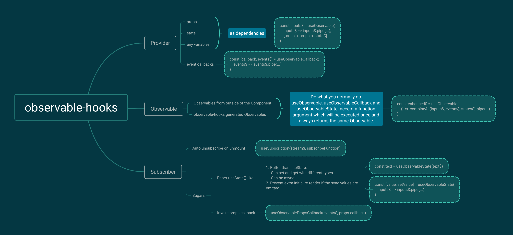

# Core Concepts

## TL;DR



## Producer

Producers produce normal values. Normal values can be converted into Observables via many different helpers which use `observable.next` under the hood.

### useObservable

In the context of React Function Component, changes of props, states and any variable can be captured with the `useEffect` hook. This makes it a valid Producer.

Observable Hooks offers [`useObservable`][useObservable] to convert these values into Observables.

### useObservableCallback

Another way to produce values is via callbacks. Whether it is data fetching or DOM event, anything inside React Components that accepts function callbacks can be converted into Observables with [`useObservableCallback`][useObservableCallback].

## Observable

React Function Components can be called many times untill they are unmounted.

Observable manipulations should be performed inside the first function argument of [`useObservable`](#useobservable), [`useObservableCallback`](#useobservablecallback) or [`useObservableState`](#useobservablestate) which is called only once and always returns the same Observable.

Since the function arugment is called only once it is not safe to directly reference other variables in closure.

```javascript
function App(props) {
  const [onChange, textChange$] = useObservableCallback(
    event$ => event$.pipe(
      map(event => {
        return {
          text: event.currentTarget.value,
          flag: props.flag // always the initial value
        }
      })
    )
  )
}
```

You should convert it into Observable and use `withLatestFrom`.

```javascript
function App(props) {
  const flag$ = useObservable(pluckFirst, [props.flag])

  const [onChange, textChange$] = useObservableCallback(
    event$ => event$.pipe(
      withLatestFrom(flag$),
      map(([event, flag]) => {
        return {
          text: event.currentTarget.value,
          flag
        }
      })
    )
  )
}
```

If you already have multiple Observables and want to do something with them together, use [`useObservable`][useObservable] without dependencies.

```javascript
const enhanced$ = useObservable(() => {
  return combineAll(stream1$, stream2$)
})
```

## Observer

Observers consume values emitted from Observables and perform side effects.

### useSubscription

Instead of manually subscribe Observables, use [`useSubscription`][useSubscription] which will auto-unsubscribe on unmount. You can also reference closure variables directly inside callback. [`useSubscription`][useSubscription] will ensure the latest callback is called.

```javascript
const [debug, setDebug] = useState(false)
const subscription = useSubscription(events$, null, error => {
  if (debug) {
    console.log(error)
  }
})
```

Directly reference props:

```javascript
const subscription = useSubscription(events$, props.onChange)
```

### useObservableState

[`useObservableState`][useObservableState] is a sugar of [`useObservable`](#useobservable) + [`useSubscription`](#usesubscription) + `useState` to get states from Observables. Unlike directly setting state on subscription, [`useObservableState`][useObservableState] will skip any initial sync re-rendering.

## Helpers

You may alreay notice that the first function argument of [`useObservable`](#useobservable), [`useObservableCallback`](#useobservablecallback) and [`useObservableState`](#useobservablestate) is pure. This makes it highly testable and reuseable. In fact, Observable Hooks offers a few common helpers to reduce garbage collection. They are [`identity`][identity], [`pluckFirst`][pluckFirst], [`pluckCurrentTargetValue`][pluckCurrentTargetValue] and [`pluckCurrentTargetChecked`][pluckCurrentTargetChecked].


[useobservable]: ../api/README.md#useobservable
[useObservableCallback]: ../api/README.md#useobservablecallback
[useSubscription]: ../api/README.md#usesubscription
[useObservableState]: ../api/README.md#useobservablestate
[identity]: ../api/README.md#identity
[pluckFirst]: ../api/README.md#pluckfirst
[pluckCurrentTargetValue]: ../api/README.md#pluckcurrenttargetvalue
[pluckCurrentTargetChecked]: ../api/README.md#pluckcurrenttargetchecked
